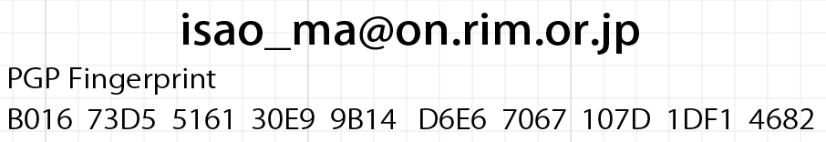

# PGPインストール会について

(このミニHands-onはCedric Sam氏講義の前座で、オプションです。Samの講義は18:20ごろ開始予定です)

スノーデン事件以降、セキュリティに関して誰も信じられない世界になりました。メールはもともとセキュリティなどあってなきが如きの通信手段です。記者がセキュリティに無頓着であっても本人の勝手ですが、情報提供側はそうは考えないかもしれません。

PGP(Pretty Good Privacy)という仕組みは、End to Endでセキュリティを実現する方法で、スノーデン事件でも、彼が記者と最初の接触をする際に使われました。その基本的な仕組みと使い方について説明します（30分程度）。当日資料を配布します。

あなたが調査報道を担当していない場合でも、PGPを使う意味があります。社内で調査報道班だけがPGPを使っていたら、何が機密情報か、旗を振って攻撃場所を教えているようなものです。

必要なもの
* 個人使用のノートパソコン
* (メール送受信可能な人同士で、その場で鍵を交換します。Portable Wifiなどをお持ちの方は協力してください。)
* 鍵保存用のUSB（できれば）

予め、[Gpg4win(Windowsの場合)](https://www.gpg4win.org/)か[GPGTools(Macの場合)](https://gpgtools.org/)をダウンロードして参加してください。
オプションとして、メールに一体化して使いたい場合には、[Thunderbird](http://www.mozilla.jp/thunderbird/)をインストールし、アドオンで「Enigmail」を追加してください。

### NICAR16について

日本記者クラブで紹介したNICAR(Computer-Assisted Reporting Conference)の[2016年会議](http://ire.org/conferences/nicar2016/)の日程が、3月10-13日デンバー開催と発表されました。
会費は260ドルですが、IREの会員である必要があるので年会費70ドルも必要になります。この種の会議では、欧州のSchool of Journalism（無料）に次いで安価で、**もっとも実践的**です（つまり、管理職が視察に行くタイプの催しではありません）。明け方まで話が盛り上がる「祭典」なので、可能な限り、会場のホテルを使うことをお勧めします。

内容は今年のものが参考になります。

* [2015年のスケジュール](http://ire.org/conferences/nicar2015/schedule/)
* [講義資料のリンク集](http://blog.chryswu.com/2015/02/20/nicar-2015-slides-links-tutorials/)

英語のレベルは容赦ありませんが、技術が分かる人には理解できるでしょう。

* [ライトニングトークの動画](http://ire.org/conferences/nicar2015/lightning-talks/)

なお、11月2日には香港でHacks Hackers Hong KongがGoogle Hong Kongで開かれます。今回のテーマはGIS(電子地図情報システム)です。
LCCを使えば大阪出張と費用は大差ありませんので、観光がてらNICARの雰囲気を味わうこともできます。

### 参加する皆様へ

できる限り、**高速回線と最新パソコン、音が聴ける環境**で、以下のリンクリストの５件について、自分で体験しておいてください。

* [スノーフォール(2012)](http://www.nytimes.com/projects/2012/snow-fall/#/?part=tunnel-creek)

#### 書き出し部分の邦訳

> 　前触れもなく木々をすり抜け、最後の瞬間にしゅっと音をさせるだけの、２階建てほどの高さの雪の奔流。
>クリス・ラドルフが叫んだ。「雪崩だ、エリーゼ！」 
> 　16人のスキーヤー、スノーボーダーが探し求めたまさにそのものが、瞬時に敵になった。峰の上のどこかで、
>雪の平原に雷状の亀裂が入り、幅200フィート、厚さ3フィートの塊を切り出した。あとは重力に任せるだけだ。 
> 　雪は砕け、坂に溢れ出した。数秒以内に、暴走する千台の車よりも大きく、数百万ポンドの塊になった。
>時速約70マイルで木々にぶつかり、枝をもぎ、樹皮を切り裂いた。 
> 　2月にワシントン州カスケードで発生したその雪崩は、航行する船の舳先で海が盛り上がるように、木や石を
>あるいはよけ、あるいは飲み込みながら、体積を増していった。 
> 　内部には人がいた。何人なのか、誰も知らない。

* [ジョッキー(2013)](http://www.nytimes.com/projects/2013/the-jockey/#/?chapt=introduction)

#### 書き出し部分の邦訳

> 　その日の午後は、思い通りに進んでいた。ラッセルベイズは最初の３レースを勝った。 
> 「きょうは楽勝のようだ」。第三レースを終えて、彼は言った。歩くと自然に鼻歌も出る。
>何かのメロディーというわけでもない、喜びの歌。 
> 　ところが、第四レースは着外、第五レースは頭差で負けた。次が注目のレースだ。
>ベイズは青鹿毛の牝馬に乗った。馬は、そうすべきだと分かっているように、ゲートに収まった。顔を上げ、足も据わった。 
> 　ゲートが開いた。アメリカ史上最多勝の騎手、ラッセル・ベイズは出来る限りの声で「ヤー」と叫んだ。

* [中国巨大洞窟(2014)](http://www.nationalgeographic.com/china-caves/supercaves/)
* [アルプ・デュエズの上り坂(2015)](http://www.theguardian.com/sport/ng-interactive/2015/jul/23/tour-de-france-the-climb-of-alpe-dhuez-interactive)
* [クロノス四重奏団(2014)](http://www.nytimes.com/interactive/2014/09/22/arts/music/kronos-quartet.html?ref=arts)

#### 筆者について

* [箱根で入山規制](http://www.tokyo-np.co.jp/hold/2015/hakone/hakone_t.html)

# デジタルジャーナリズム事例集

	* 最新のパソコンと高速回線で、英語の分かる人の解説付きで見る
	* 同じものを作るためにどんな技術・ノウハウが必要か想像する
	* ほとんどがin-house production(内製)

* 長文記事
	* [希望と不安の街角で](http://www.nytimes.com/interactive/2012/10/14/us/this-land-elyria-ohio.html): オハイオ州の小さな街の物語(2012)
	* [スノーフォール](http://www.nytimes.com/projects/2012/snow-fall/#/?part=tunnel-creek): ワシントン州の雪崩事故(2012)
	* [ジョッキー](http://www.nytimes.com/projects/2013/the-jockey/#/?chapt=introduction): 米最多勝ジョッキーに密着(2013)
	* [天安門からの声](http://multimedia.scmp.com/tiananmen/): 南方早報の天安門事件25周年特集

* 動画
	* [私は死にました](http://www.nytimes.com/video/obituaries/1194817093353/i-just-died.html): 著名コラムニストの生前ビデオ
	* [スノーフォール](https://www.youtube.com/watch?t=186&v=cjzT15-oQq0): ビデオ版
	* [雨傘運動](http://www.msnbc.com/msnbc/watch/and-then-hell-broke-loose-367963715731): 香港大学ジャーナリズム学科の学生作品

* 地理情報
	* [イスラム国の版図](http://int.nyt.com/newsgraphics/contests/2014/snd-digital/isis-in-maps-as-of-dec-31-2014/index.html): 参照データがない地図
	* [ガザ地区の被害推定](http://www.nytimes.com/interactive/2014/07/27/world/middleeast/assessing-the-damage-and-destruction-in-gaza.html): 衛星画像の独自分析

* インタラクティブ
	* [中国高官コネクション](http://china.fathom.info): ロイターとデザイン事務所Fathomが製作(2013)
	* [買うか借りるか](http://www.nytimes.com/interactive/2014/upshot/buy-rent-calculator.html): 多変数に対応した計算機
	* [所得と進学率の関係](http://www.nytimes.com/interactive/2015/05/28/upshot/you-draw-it-how-family-income-affects-childrens-college-chances.html): 読者に予想させ、それに応じたテキストを表示する
	* [アルゴリズムを図解する](http://bost.ocks.org/mike/algorithms/): 手順を説明する記事

* 3Dグラフィックス(webGL)
	* [中国巨大洞窟](http://www.nationalgeographic.com/china-caves/supercaves/): レーザースキャナーによる計測
	* [未踏の壁](http://www.nytimes.com/interactive/2015/01/09/sports/the-dawn-wall-el-capitan.html): webGLと超高解像度写真
	* [未来を写すイールドカーブ](http://www.nytimes.com/interactive/2015/03/19/upshot/3d-yield-curve-economic-growth.html)
	* [アルプ・デュエズの上り坂](http://www.theguardian.com/sport/ng-interactive/2015/jul/23/tour-de-france-the-climb-of-alpe-dhuez-interactive): ツールドフランス

* センサー
	* [クロノス四重奏団](http://www.nytimes.com/interactive/2014/09/22/arts/music/kronos-quartet.html?ref=arts): Kinectによるデータ収集
	* [水没するルイジアナ](http://projects.propublica.org/louisiana/): 衛星、ドローン、バルーンによるデータ収集
	* [17年蝉を追え](http://project.wnyc.org/cicadas/map.html#7.00/39.802/-74.782): Arduinoによるデータ収集。視聴者参加イベント
	* [家猫の秘密の生活](https://vimeo.com/108062526): GPSセンサー

* データ公開
	* [国会議員辞職理由](http://www.morgenpost.de/politik/article126044847/Why-Members-of-the-German-Parliament-resign.html?config=interactive): 元データをGithubで公開
	* [免税NPOの高額収入](https://projects.propublica.org/nonprofits/): 膨大なデータ処理

* 機械学習
	* [法曹界の反響室](http://www.reuters.com/investigates/special-report/scotus/): 機械学習による文書分類
	* [GE第二四半期決算発表](http://news.yahoo.com/ge-2q-profit-climbs-13-percent-110903999--finance.html): ロボットによる原稿
	* [子育て環境を周辺と比較](http://www.nytimes.com/interactive/2015/05/03/upshot/the-best-and-worst-places-to-grow-up-how-your-area-compares.html): 地図の自動フォーカスとテキストの自動生成

* 作品リスト
	* [スペインMolofiej23](http://www.malofiejgraphics.com/wp-content/uploads/2015/03/M23_Awards-List_OK.pdf)
	* [米SND2014](http://www.snd.org/2015/03/winners-list-2014-best-of-digital-design-competition/)
	* [米ONA2014](http://journalists.org/2014/09/27/seattle-times-pro-publica-npr-take-home-2014-online-journalism-awards/)
	* [GENデータジャーナリズム賞2014](http://www.globaleditorsnetwork.org/programmes/data-journalism-awards/2014-shortlist/)
	* [NYT作品集2014](http://www.nytimes.com/interactive/2014/12/29/us/year-in-interactive-storytelling.html)

### 組織・イベント

* [全米調査報道記者編集者協会](http://www.ire.org/nicar/)
* [欧州ジャーナリズムフェスティバル](http://www.journalismfestival.com)
* [オンラインニュース協会](http://journalists.org)

